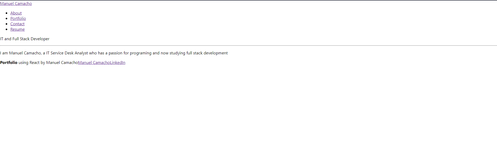

# React-Portfolio

This project uses react to make a front end portfolio. The app does not currently have any stylings so it is very basic and simple looking. The app uses different components to render different things into the page without having the whole page reload. In the app you can click on the nav bar and it will load whatever information is needed to load. Website is not deployed but it can be launched with npm start

